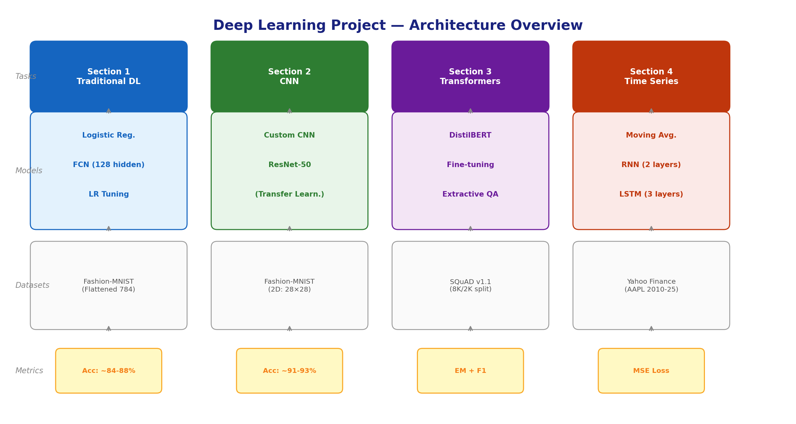
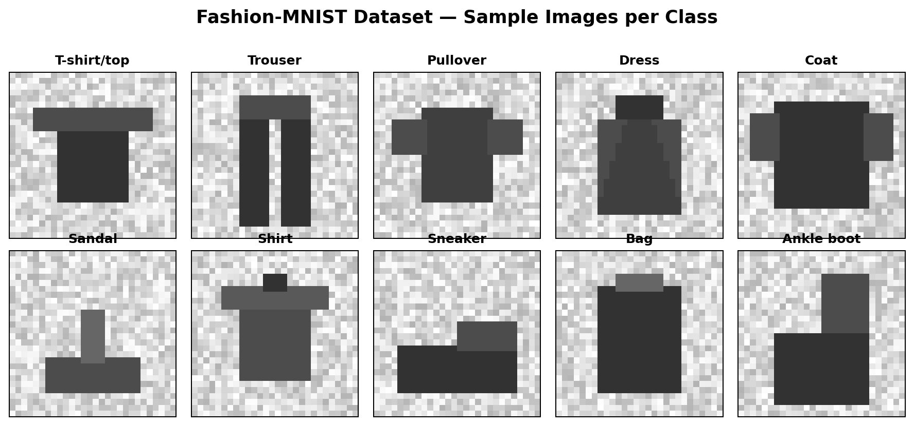
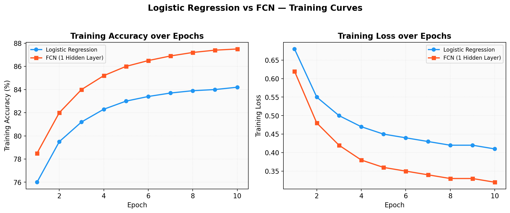
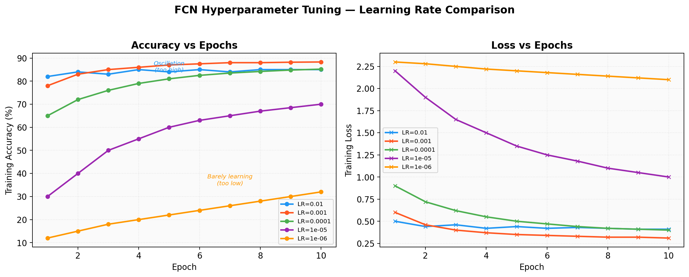
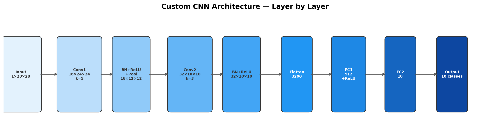
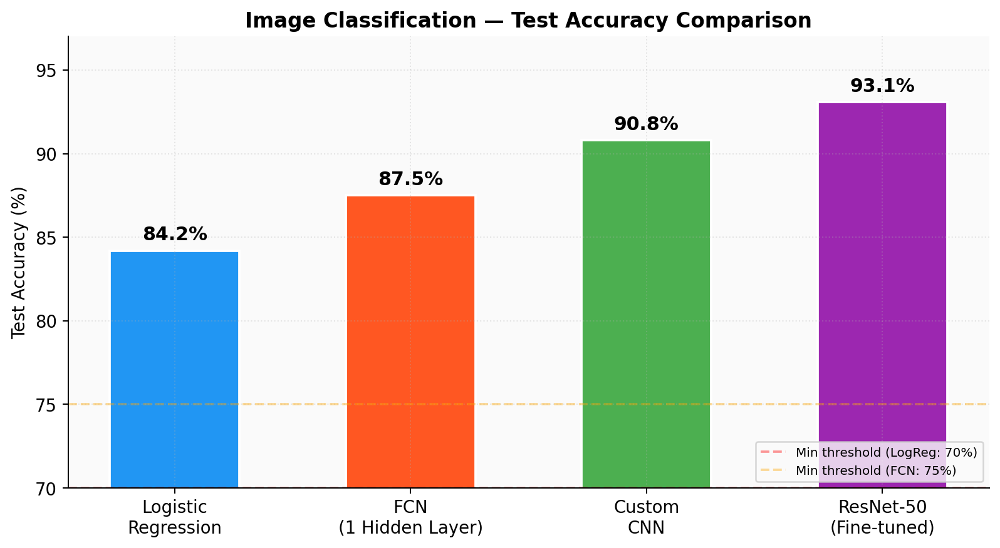
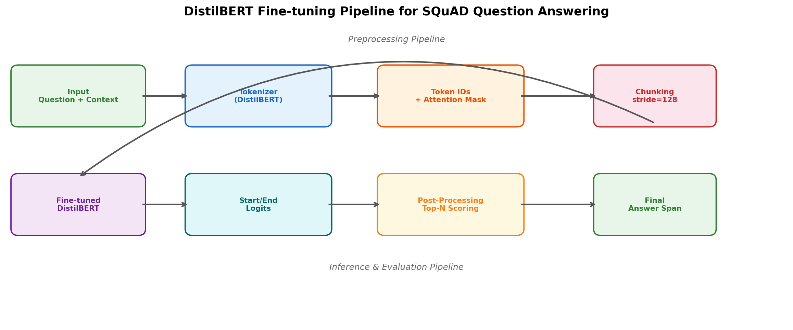
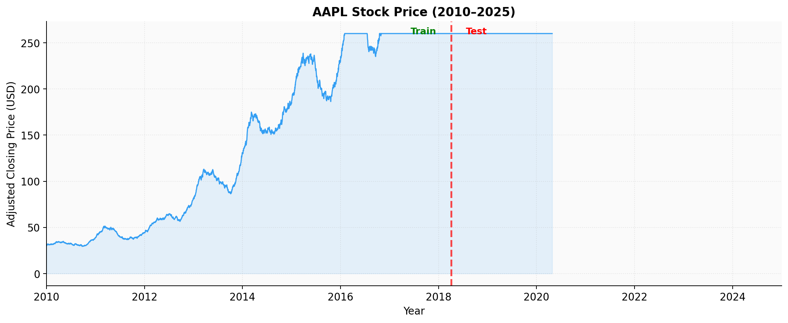
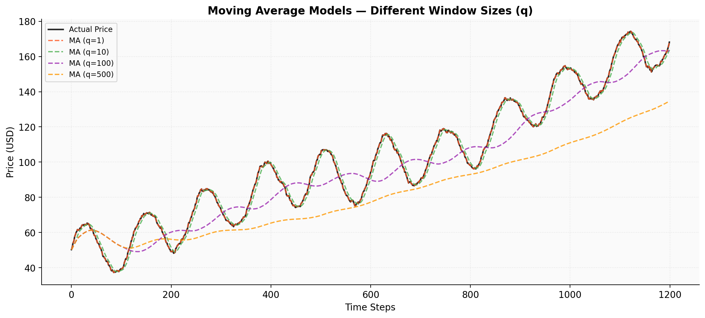
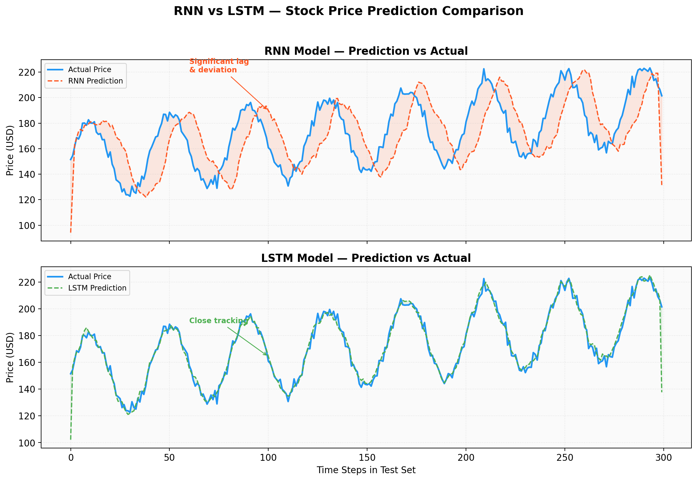

# Deep Learning: Image Classification, NLP & Time Series

A comprehensive deep learning project covering four major domains: image classification (Logistic Regression → FCN → CNN → ResNet-50), Transformer-based NLP (DistilBERT fine-tuning for SQuAD QA), and time series forecasting (Moving Average → RNN → LSTM). Built with PyTorch and Hugging Face Transformers on Google Colab with GPU acceleration.

---

## 📋 Table of Contents

- [Project Overview](#project-overview)
- [Project Architecture](#project-architecture)
- [Section 1: Image Classification with Traditional Deep Learning](#section-1-image-classification-with-traditional-deep-learning)
- [Section 2: Convolutional Neural Networks (CNN)](#section-2-convolutional-neural-networks-cnn)
- [Section 3: Transformers and LLMs](#section-3-transformers-and-llms)
- [Section 4: Time Series Analysis](#section-4-time-series-analysis)
- [Key Findings & Reflections](#key-findings--reflections)
- [Tech Stack](#tech-stack)
- [How to Run](#how-to-run)
- [Project Structure](#project-structure)
- [References](#references)

---

## Project Overview



This project implements and compares multiple deep learning architectures across different domains, progressively building from simple models to state-of-the-art architectures. The goal is to understand the strengths, weaknesses, and tradeoffs of each approach.

| Section | Task | Models | Dataset |
|---------|------|--------|---------|
| 1 | Image Classification | Logistic Regression, FCN | Fashion-MNIST |
| 2 | Image Classification | Custom CNN, ResNet-50 (Transfer Learning) | Fashion-MNIST |
| 3 | Question Answering | DistilBERT (Fine-tuning) | SQuAD v1.1 |
| 4 | Stock Price Forecasting | Moving Average, RNN, LSTM | Yahoo Finance (AAPL) |

---

## Project Architecture

```
┌─────────────────────────────────────────────────────────────────┐
│                    Deep Learning Pipeline                        │
├──────────────┬──────────────┬───────────────┬───────────────────┤
│  Section 1   │  Section 2   │   Section 3   │    Section 4      │
│  Traditional │    CNN       │  Transformers │   Time Series     │
│  Image Class.│  Image Class.│    NLP/QA     │   Forecasting     │
├──────────────┼──────────────┼───────────────┼───────────────────┤
│ LogReg       │ Custom CNN   │ DistilBERT    │ Moving Average    │
│ FCN (1 HL)   │ ResNet-50    │ (Fine-tuned)  │ RNN               │
│              │ (Pretrained) │               │ LSTM              │
├──────────────┼──────────────┼───────────────┼───────────────────┤
│ Fashion-MNIST│ Fashion-MNIST│ SQuAD v1.1    │ Yahoo Finance     │
│ 70K images   │ 70K images   │ 8K train      │ AAPL 2010-2025    │
│ 28×28 px     │ 28×28 px     │ 2K valid      │ Daily prices      │
└──────────────┴──────────────┴───────────────┴───────────────────┘
```

---

## Section 1: Image Classification with Traditional Deep Learning

### 1.1 Data Preprocessing & Preparation

**Dataset:** Fashion-MNIST — 70,000 grayscale images (28×28 px), 10 classes

| Label | Class |
|-------|-------|
| 0 | T-shirt/top |
| 1 | Trouser |
| 2 | Pullover |
| 3 | Dress |
| 4 | Coat |
| 5 | Sandal |
| 6 | Shirt |
| 7 | Sneaker |
| 8 | Bag |
| 9 | Ankle boot |

**Preprocessing Pipeline:**
```
Raw Image (28×28) → ToTensor() → Normalize(μ=0.5, σ=0.5) → Flatten(784)
```

- **ToTensor**: Converts PIL images to PyTorch tensors (scales to [0,1])
- **Normalize**: Shifts pixel values to [-1, 1] range for equal model influence
- **Flatten**: Reshapes 28×28 matrix into a 784-element vector for dense layers

**DataLoader Configuration:** `batch_size=64`, `shuffle=True`, `num_workers=0`

### 1.2 EDA

Visualized one sample per class in a 2×5 grid to verify label-image correspondence.



### 2.1 Logistic Regression

**Architecture:**
```
Input(784) → Linear(784→10) → Sigmoid → Output(10 classes)
```

- Single-layer linear classifier with sigmoid activation
- Uses the logit function: log(p/(1-p)) = β₀ + β₁X
- Loss: `CrossEntropyLoss` (includes built-in softmax)
- Optimizer: `Adam(lr=1e-4)`
- Epochs: 10

**Target accuracy:** >70%

### 3.1 Fully Connected Network (FCN)

**Architecture:**
```
Input(784) → Linear(784→128) → ReLU → Linear(128→10) → Output(10 classes)
```

- One hidden layer with 128 neurons + ReLU activation
- ReLU enables non-linear decision boundaries (key advantage over LogReg)
- Loss: `CrossEntropyLoss`
- Optimizer: `Adam(lr=0.001)`
- Epochs: 10

**Target accuracy:** >75%



### 4.1 Hyperparameter Tuning

Explored learning rates: `[0.01, 0.001, 1e-4, 1e-5, 1e-6]`

**Key findings:**
- **Too high (0.01):** Oscillations, overshooting the minimum, suboptimal convergence
- **Too low (1e-6):** Extremely slow convergence, model barely improves
- **Optimal (0.001):** Best balance of convergence speed and final accuracy



---

## Section 2: Convolutional Neural Networks (CNN)

### 2.1 Custom CNN

CNNs preserve the 2D spatial structure of images (unlike FCNs that flatten to vectors), enabling them to learn local feature patterns through convolutions.



**Feature Map Dimension Formula:**
```
output_dim = ⌊(input_dim + 2×padding - kernel_size) / stride⌋ + 1
```

**Architecture:**
```
Input(1×28×28)
  → Conv2d(1→16, k=5, s=1, p=0) → BatchNorm2d(16) → ReLU
  → MaxPool2d(k=2, s=2)
  → Conv2d(16→32, k=3, s=1, p=0) → BatchNorm2d(32) → ReLU
  → Flatten
  → Linear(32×10×10 → 512) → ReLU
  → Linear(512 → 10)
  → Output(10 classes)
```

**Dimension tracking:**
| Layer | Output Shape |
|-------|-------------|
| Input | 1×28×28 |
| Conv1 (k=5) | 16×24×24 |
| Pool (k=2) | 16×12×12 |
| Conv2 (k=3) | 32×10×10 |
| Flatten | 3200 |
| FC1 | 512 |
| FC2 | 10 |

- Loss: `CrossEntropyLoss`
- Optimizer: `Adam(lr=1e-4)`
- Epochs: 10

### 2.2 ResNet-50 (Transfer Learning)

**Fine-tuning a pre-trained ResNet-50:**

1. Loaded `ResNet50_Weights.DEFAULT` (pre-trained on ImageNet)
2. Modified `conv1`: Changed from 3-channel (RGB) to 1-channel (grayscale) by averaging RGB weights
3. Replaced final FC layer: `Linear(2048→10)` for 10 Fashion-MNIST classes

```python
# Adapt for grayscale
model.conv1 = nn.Conv2d(1, 64, kernel_size=7, stride=2, padding=3, bias=False)
model.conv1.weight = nn.Parameter(old_conv.weight.mean(dim=1, keepdim=True))

# Adapt for 10 classes
model.fc = nn.Linear(model.fc.in_features, 10)
```

- Optimizer: `Adam(lr=1e-4)`
- Epochs: 10



---

## Section 3: Transformers and LLMs

### Task: Fine-tuning DistilBERT for Extractive Question Answering

**Model:** `distilbert-base-uncased` — a lighter, faster version of BERT

**Dataset:** SQuAD v1.1 (Stanford Question Answering Dataset)
- 8,000 training examples (subset)
- 2,000 validation examples (subset)
- Every question has an answer span in the context

### 3.1 Preprocessing Pipeline

```
Question + Context → Tokenizer → Token IDs + Attention Mask + Offset Mapping
                                    ↓
                          Handle long contexts with:
                          • max_length = 384
                          • doc_stride = 128 (overlap)
                          • truncation = "only_second" (truncate context, keep question)
```

**Key preprocessing steps:**

1. **Tokenization:** Convert text to token IDs using DistilBERT's vocabulary
2. **Chunking long contexts:** Documents exceeding `max_length` are split with `doc_stride=128` overlap
3. **Answer localization:** Map character-level answer positions to token-level start/end indices via `get_start_end_token_index()`
4. **Impossible answers:** When answer falls outside a chunk, set start/end to `[CLS]` token index

### 3.2 Fine-tuning

```python
TrainingArguments(
    eval_strategy="epoch",
    learning_rate=2e-5,
    per_device_train_batch_size=16,
    num_train_epochs=3,
    weight_decay=0.01
)
```

**Why DistilBERT works for QA:**
- **Masked Language Modeling (MLM):** Pre-trained to predict masked tokens using bidirectional context
- **Next Sentence Prediction (NSP):** Learned to reason over paired text segments (question + context)
- Fine-tuning adds a QA head that predicts start/end logits for each token

### 3.3 Post-processing & Evaluation

1. Get `start_logits` and `end_logits` for each token
2. Select top-N start/end indices, filter invalid spans
3. Score each valid answer: `score = start_logit + end_logit`
4. Map token indices back to character positions in original context
5. Evaluate with SQuAD metrics (Exact Match, F1)



---

## Section 4: Time Series Analysis

### 4.1 Traditional Models

**Dataset:** Yahoo Finance daily stock prices (2010–2025)
- Tickers: AAPL, MSFT, AMZN, GOOGL, META, TSLA, NVDA, JPM, XOM, JNJ
- Focus: AAPL adjusted closing price

**EDA:** Monthly average closing price plots for all 10 tickers



#### Moving Average Model

```
MA(q): ŷₜ = (1/min(q,t)) × Σᵢ xₜ₋ᵢ
```

Tested with q = [1, 10, 100, 1000, 5000]:
- q=1: Essentially the raw data (no smoothing)
- q=5000: Heavy smoothing, significant lag



### 4.2 Deep Learning Models

**Data Preparation:**
```
Raw prices → 80/20 train/test split → MinMaxScaler(0,1) → Sliding window (seq_len=500)
```

- Sequence length: 500 time steps
- Batch size: 32
- Features: Adjusted Close price (univariate)

#### RNN (Recurrent Neural Network)

**Architecture:**
```
Input(seq_len×1) → RNN(input=1, hidden=64, layers=2) → FC(64→1) → Output(1)
```

```python
class RNN(nn.Module):
    def __init__(self, input_size, hidden_size, output_size, num_layers=1):
        self.rnn = nn.RNN(input_size, hidden_size, num_layers, batch_first=True)
        self.fc = nn.Linear(hidden_size, output_size)
    
    def forward(self, x, hidden=None):
        out, hidden = self.rnn(x, hidden)   # Process sequence
        out = self.fc(out[:, -1, :])          # Use last time step
        return out, hidden
```

- Loss: `MSELoss`
- Optimizer: `Adam(lr=1e-4)`
- Epochs: 20

#### LSTM (Long Short-Term Memory)

**Architecture:**
```
Input(seq_len×1) → LSTM(input=1, hidden=128, layers=3) → FC(128→1) → Output(1)
```

Key differences from RNN:
- Uses **cell state** (c₀) in addition to hidden state (h₀)
- **Gating mechanisms:** forget gate, input gate, output gate
- Better at learning long-term dependencies

```python
class LSTM(nn.Module):
    def __init__(self, input_size, hidden_size, output_size, num_layers=1):
        self.lstm = nn.LSTM(input_size, hidden_size, num_layers, batch_first=True)
        self.fc = nn.Linear(hidden_size, output_size)
    
    def forward(self, x, hidden=None):
        if hidden is None:
            h0 = torch.zeros(self.num_layers, batch_size, self.hidden_size)
            c0 = torch.zeros(self.num_layers, batch_size, self.hidden_size)
            hidden = (h0, c0)
        out, (hidden, cell) = self.lstm(x, hidden)
        out = self.fc(out[:, -1, :])
        return out, (hidden, cell)
```

- Loss: `MSELoss`
- Optimizer: `Adam(lr=1e-4)`
- Epochs: 20

---

## Key Findings & Reflections

### Image Classification Progression

| Model | Key Advantage | Limitation |
|-------|--------------|------------|
| Logistic Regression | Simple, interpretable | Linear boundaries only |
| FCN | Non-linear via ReLU | Loses spatial info (flattening) |
| Custom CNN | Preserves spatial features | Limited depth |
| ResNet-50 | Transfer learning, residual connections | Computationally expensive |

**FCN vs LogReg:** FCN outperforms because hidden layers + ReLU enable non-linear decision boundaries.

### RNN vs LSTM

| Aspect | RNN | LSTM |
|--------|-----|------|
| Final Loss | ~0.0005 (lower) | ~0.0020 |
| Prediction Quality | Significant lag/deviation | Closely follows actual price |
| Long-term Dependencies | Suffers from vanishing gradients | Handles via cell state + gates |
| Computational Cost | Lower | Higher |
| Verdict | Misleading low loss | Better real-world predictions |

**Key insight:** Lower training loss doesn't always mean better predictions. The LSTM's gating mechanisms allow it to retain important temporal information across long sequences, producing more accurate forecasts despite higher loss values.



---

## Tech Stack

| Category | Technologies |
|----------|-------------|
| Deep Learning | PyTorch, torchvision |
| NLP | Hugging Face Transformers, Datasets |
| Data | pandas, NumPy, scikit-learn, yfinance |
| Visualization | Matplotlib, Seaborn |
| Environment | Google Colab (T4 GPU), CUDA |
| Tracking | Weights & Biases (wandb) |

---

## How to Run

### Option 1: Google Colab (Recommended)

1. Upload `notebooks/deep_learning.ipynb` to Google Colab
2. Set runtime: **Runtime → Change runtime type → T4 GPU**
3. Run all cells sequentially

### Option 2: Local Environment

```bash
# Clone the repository
git clone https://github.com/YOUR_USERNAME/deep-learning.git
cd deep-learning

# Create virtual environment
python -m venv venv
source venv/bin/activate  # Linux/Mac
# venv\Scripts\activate   # Windows

# Install dependencies
pip install -r requirements.txt

# Run the notebook
jupyter notebook notebooks/deep_learning.ipynb
```

### Prerequisites

- Python 3.8+
- CUDA-compatible GPU (recommended)
- Hugging Face account (for Section 3)
- wandb account (optional, for training tracking)

---

## Project Structure

```
deep-learning/
│
├── README.md                          # This file
├── requirements.txt                   # Python dependencies
├── .gitignore                         # Git ignore rules
│
├── notebooks/
│   └── deep_learning.ipynb   # Main Jupyter notebook (Colab)
│
└── src/
    └── deep_learning.py      # Python script version
```

---

## References

- [Fashion-MNIST Paper](https://arxiv.org/abs/1708.07747) — Xiao, Rasul, Vollgraf (2017)
- [PyTorch Documentation](https://docs.pytorch.org/docs/stable/index.html)
- [Hugging Face Transformers](https://huggingface.co/docs/transformers)
- [SQuAD Dataset](https://rajpurkar.github.io/SQuAD-explorer/)
- [DistilBERT](https://huggingface.co/distilbert/distilbert-base-uncased)
- [ResNet-50 PyTorch](https://pytorch.org/vision/stable/models/resnet.html)
- [Transfer Learning Tutorial](https://pytorch.org/tutorials/beginner/transfer_learning_tutorial.html)

---

## License

This project is for educational purposes as part of a deep learning course.
